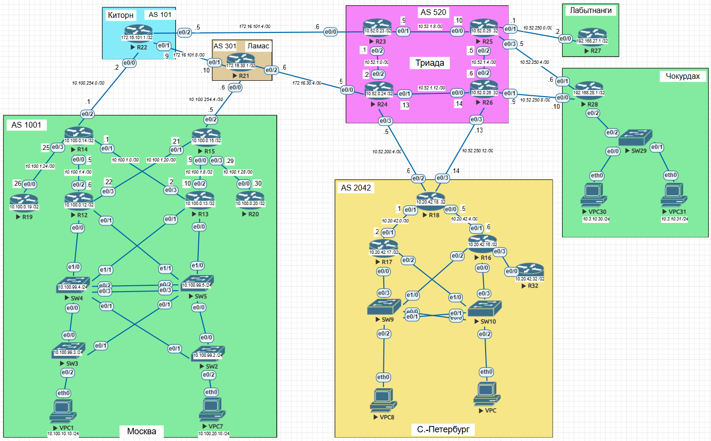

# Архитектура сети

## Задание:

1. Разработать и задокументировать адресное пространство для лабораторного стенда;
2. Настроить ip-адреса на каждом активном порту;
3. Настроить каждый VPC в каждом офисе в своем VLAN;
4. Настроить VLAN/Loopbackup interface управления для сетевых устройств;
5. Настроить сети офисов так, чтобы не возникало broadcast штормов, а использование линков было максимально оптимизировано;
6. Использовать IPv4. IPv6 по желанию.

## Решение:

### Адресация

Для маршрутизации и управления выделены следующие диапазоны:

- **AS 1001 (Москва):** `10.100.0.0/16`
- **AS 520 (Триада):** `10.52.0.0/16`
- **AS 2042 (С.-Петербург):** `10.20.42.0/24`
- **AS 101 (Киторн):** `172.16.101.0/24`
- **AS 301 (Ламас):** `172.16.30.0/24`
- **Лабытнанги:** `192.168.27.0/24`
- **Чокурдах:** `192.168.28.0/24`

<picture>
 <source media="(prefers-color-scheme: dark)" srcset="YOUR-DARKMODE-IMAGE">
 <source media="(prefers-color-scheme: light)" srcset="YOUR-LIGHTMODE-IMAGE">
 
</picture>

### Таблица IP-адресации

#### Провайдеры: AS 101 (Киторн), AS 301 (Ламас) и AS 520 (Триада)

| Устройство | Интерфейс | IP Адрес      | Маска | Описание              |
| ---------- | --------- | ------------- | ----- | --------------------- |
| Ламас      |           |               |       |                       |
| **R21**    | Lo0       | 172.16.30.1   | /32   | Loopbackup            |
| **R21**    | e0/0      | 172.16.30.6   | /30   | R24 (AS 520)          |
| **R21**    | e0/1      | 172.16.101.10 | /30   | R22                   |
| **R21**    | e0/2      | 10.100.254.6  | /30   | R15 (AS 1001)         |
| Киторн     |           |               |       |                       |
| **R22**    | Lo0       | 172.16.101.1  | /32   | Loopbackup            |
| **R22**    | e0/0      | 10.100.254.2  | /30   | R14 (AS 1001)         |
| **R22**    | e0/1      | 172.16.101.9  | /30   | R21                   |
| **R22**    | e0/2      | 172.16.101.5  | /30   | R23 (AS 520)          |
| Триада     |           |               |       |                       |
| **R23**    | Lo0       | 10.52.0.23    | /32   | Loopbackup            |
| **R23**    | e0/0      | 172.16.101.6  | /30   | R22 (AS 101 - Киторн) |
| **R23**    | e0/1      | 10.52.1.9     | /30   | R25                   |
| **R23**    | e0/2      | 10.52.1.1     | /30   | R24                   |
| -          |           |               |       |                       |
| **R24**    | Lo0       | 10.52.0.24    | /32   | Loopbackup            |
| **R24**    | e0/0      | 172.16.30.5   | /30   | R21 (AS 301 - Ламас)  |
| **R24**    | e0/1      | 10.52.1.13    | /30   | R26                   |
| **R24**    | e0/2      | 10.52.1.2     | /30   | R23                   |
| **R24**    | e0/3      | 10.52.200.5   | /30   | R18 (AS 2042 - Питер) |
| -          |           |               |       |                       |
| **R25**    | Lo0       | 10.52.0.25    | /32   | Loopbackup            |
| **R25**    | e0/0      | 10.52.1.10    | /30   | R23                   |
| **R25**    | e0/1      | 10.52.250.1   | /30   | R27 (Лабытнанги)      |
| **R25**    | e0/2      | 10.52.1.5     | /30   | R26                   |
| **R25**    | e0/3      | 10.52.250.5   | /30   | R28 (Чокурдах)        |
| -          |           |               |       |                       |
| **R26**    | Lo0       | 10.52.0.26    | /32   | Loopbackup            |
| **R26**    | e0/0      | 10.52.1.14    | /30   | R24                   |
| **R26**    | e0/1      | 10.52.250.9   | /30   | R28 (Чокурдах)        |
| **R26**    | e0/2      | 10.52.1.6     | /30   | R25                   |
| **R26**    | e0/3      | 10.52.250.13  | /30   | R18 (AS 2042 - Питер) |

#### AS1001 (Москва)

| Устройство | Интерфейс | IP Адрес     | Маска | Описание            |
| ---------- | --------- | ------------ | ----- | ------------------- |
| **R14**    | Lo0       | 10.100.0.14  | /32   | Loopbackup          |
| **R14**    | e0/0      | 10.100.1.5   | /30   | Линк к R12          |
| **R14**    | e0/1      | 10.100.1.1   | /30   | Линк к R13          |
| **R14**    | e0/2      | 10.100.254.1 | /30   | Линк к R22 (AS 101) |
| **R14**    | e0/3      | 10.100.1.25  | /30   | Линк к R19          |
|            |           |              |       |                     |
| **R15**    | Lo0       | 10.100.0.15  | /32   | Loopbackup          |
| **R15**    | e0/0      | 10.100.1.9   | /30   | R13                 |
| **R15**    | e0/1      | 10.100.1.21  | /30   | R12                 |
| **R15**    | e0/2      | 10.100.254.5 | /30   | Линк к R21 (AS 301) |
| **R15**    | e0/3      | 10.100.1.29  | /30   | R20                 |
|            |           |              |       |                     |
| **R12**    | Lo0       | 10.100.0.12  | /32   | Loopbackup          |
| **R12**    | e0/2      | 10.100.1.6   | /30   | R14                 |
| **R12**    | e0/3      | 10.100.1.22  | /30   | R15                 |
| **R12**    | vlan 99   | 10.100.99.12 | /24   | SW4/SW5             |
| **R12**    | vlan 10   | 10.100.10.2  | /24   |                     |
| **R12**    | vlan 20   | 10.100.20.2  | /24   |                     |
|            |           |              |       |                     |
| **R13**    | Lo0       | 10.100.0.13  | /32   | Loopbackup          |
| **R13**    | e0/2      | 10.100.1.10  | /30   | R15                 |
| **R13**    | e0/3      | 10.100.1.2   | /30   | R14                 |
| **R13**    | vlan 99   | 10.100.99.13 | /24   | SW4/SW5             |
| **R13**    | vlan 10   | 10.100.10.3  | /24   |                     |
| **R13**    | vlan 20   | 10.100.20.3  | /24   |                     |
|            |           |              |       |                     |
| **R19**    | Lo0       | 10.100.0.19  | /32   | Loopbackup          |
| **R19**    | e0/0      | 10.100.1.26  | /30   | R14                 |
|            |           |              |       |                     |
| **R20**    | Lo0       | 10.100.0.20  | /32   | Loopbackup          |
| **R20**    | e0/0      | 10.100.1.30  | /30   | R15                 |
|            |           |              |       |                     |
| **SW2**    | vlan 99   | 10.100.99.2  | /24   | MNGM                |
| **SW2**    | vlan 10   | 10.100.99.2  | /24   |                     |
| **SW2**    | vlan 20   | 10.100.99.2  | /24   |                     |
|            |           |              |       |                     |
| **SW3**    | vlan 99   | 10.100.99.3  | /24   | MNGM                |
| **SW3**    | vlan 10   | 10.100.99.3  | /24   |                     |
| **SW3**    | vlan 20   | 10.100.99.3  | /24   |                     |
|            |           |              |       |                     |
| **SW4**    | vlan 99   | 10.100.99.4  | /24   | MNGM                |
| **SW4**    | vlan 10   | 10.100.99.4  | /24   |                     |
| **SW4**    | vlan 20   | 10.100.99.4  | /24   |                     |
|            |           |              |       |                     |
| **SW5**    | vlan 99   | 10.100.99.5  | /24   | MNGM                |
| **SW5**    | vlan 10   | 10.100.99.5  | /24   |                     |
| **SW5**    | vlan 20   | 10.100.99.5  | /24   |                     |
|            |           |              |       |                     |
| **VPC1**   | eth0      | 10.100.10.10 | /24   | SW3                 |
| **VPC7**   | eth0      | 10.100.20.10 | /24   | SW2                 |


Настройка для R22

```
hostname R22
no ip domain-lookup

interface Loopback0
 ip address 172.16.101.1 255.255.255.255
 no shutdown

interface Ethernet0/0
 ip address 10.100.254.2 255.255.255.252
 no shutdown

interface Ethernet0/1
 ip address 172.16.101.9 255.255.255.252
 no shutdown

interface Ethernet0/2
 ip address 172.16.101.5 255.255.255.252
 no shutdown

ip route 10.100.0.0 255.255.0.0 10.100.254.1
ip route 172.16.30.0 255.255.255.0 172.16.101.10
ip route 10.52.0.0 255.255.0.0 172.16.101.6
```

