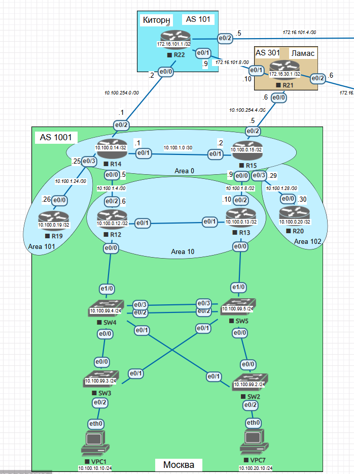

# OSPF Настройка — Офис Москва (AS 1001)

Типы областей
Area 0 - Backbone
Area 10 - Stub
Area 101 - Totally Stub (stub no-summary)
Area 102 - Normal Area + фильтрация маршрутов Area 101

R14–R15 - работают в backbone (Area 0).
R12–R13 - находятся в Area 10 и получают маршрут по умолчанию.
R19 (Area 101) - получает только маршрут по умолчанию.
R20 (Area 102) - получает все маршруты, кроме сетей Area 101.

<picture>
 
</picture>

## Настройки коммутаторов

#### R14

```
interface Loopback0
 ip address 10.100.0.14 255.255.255.255
 ipv6 address 2001:db8:14::14/128
 ip ospf 1 area 0
 ipv6 ospf 1 area 0
!
interface Ethernet0/0
 description R12
 ip address 10.100.1.5 255.255.255.252
 ipv6 address 2001:db8:10:12::14/64
 ip ospf 1 area 10
 ipv6 ospf 1 area 10
 no shutdown
!
interface Ethernet0/1
 description R15
 ip address 10.100.1.1 255.255.255.252
 ipv6 address 2001:db8:0:14::14/64
 ip ospf 1 area 0
 ipv6 ospf 1 area 0
 no shutdown
!
interface Ethernet0/2
 description R22-AS101
 ip address 10.100.254.1 255.255.255.252
 ipv6 address 2001:db8:ffff:14::2/64
 no shutdown
!
interface Ethernet0/3
 description R19
 ip address 10.100.1.25 255.255.255.252
 ipv6 address 2001:db8:101:19::14/64
 ip ospf 1 area 101
 ipv6 ospf 1 area 101
 no shutdown
!
ip route 0.0.0.0 0.0.0.0 10.100.254.2
ipv6 route ::/0 2001:db8:ffff:14::1
!
router ospf 1
 router-id 14.14.14.14
 passive-interface Loopback0
 area 10 stub
 area 101 stub no-summary
 network 10.100.0.14 0.0.0.0 area 0
 default-information originate always
!
ipv6 router ospf 1
 router-id 14.14.14.14
 area 10 stub
 area 101 stub no-summary
 default-information originate always
```

#### R15

```
interface Loopback0
 ip address 10.100.0.15 255.255.255.255
 ipv6 address 2001:db8:15::15/128
 ip ospf 1 area 0
 ipv6 ospf 1 area 0
!
interface Ethernet0/0
 description R13
 ip address 10.100.1.9 255.255.255.252
 ipv6 address 2001:db8:10:15::15/64
 ip ospf 1 area 10
 ipv6 ospf 1 area 10
 no shutdown
!
interface Ethernet0/1
 description R14
 ip address 10.100.1.2 255.255.255.252
 ipv6 address 2001:db8:0:14::15/64
 ip ospf 1 area 0
 ipv6 ospf 1 area 0
 no shutdown
!
interface Ethernet0/2
 description R21-AS301
 ip address 10.100.254.5 255.255.255.252
 ipv6 address 2001:db8:254:15::2/64
 no shutdown
!
interface Ethernet0/3
 description R20
 ip address 10.100.1.29 255.255.255.252
 ipv6 address 2001:db8:102:15::15/64
 ip ospf 1 area 102
 ipv6 ospf 1 area 102
 no shutdown
!
ip route 0.0.0.0 0.0.0.0 10.100.254.6
ipv6 route ::/0 2001:db8:254:15::1
!
router ospf 1
 router-id 15.15.15.15
 passive-interface Loopback0
 area 10 stub
 network 10.100.0.15 0.0.0.0 area 0
 default-information originate always
!
ipv6 router ospf 1
 router-id 15.15.15.15
 area 10 stub
 default-information originate always
```

#### R12

```
interface Loopback0
 ip address 10.100.0.12 255.255.255.255
 ipv6 address 2001:DB8:12::12/128
 ip ospf 1 area 10
 ipv6 ospf 1 area 10
!
interface Ethernet0/2
 description R14
 ip address 10.100.1.6 255.255.255.252
 ipv6 address 2001:DB8:10:14::12/64
 ip ospf 1 area 10
 ipv6 ospf 1 area 10
 no shutdown
!
interface Ethernet0/1
 description R13
 ip address 10.100.1.13 255.255.255.252
 ipv6 address 2001:DB8:10:1213::12/64
 ip ospf 1 area 10
 ipv6 ospf 1 area 10
 no shutdown
!
router ospf 1
 router-id 12.12.12.12
 passive-interface Loopback0
 area 10 stub
 network 10.100.0.12 0.0.0.0 area 10
!
ipv6 router ospf 1
 router-id 12.12.12.12
 area 10 stub
```

#### R13

```
interface Loopback0
 ip address 10.100.0.13 255.255.255.255
 ipv6 address 2001:DB8:13::13/128
 ip ospf 1 area 10
 ipv6 ospf 1 area 10
!
interface Ethernet0/1
 description R12
 ip address 10.100.1.14 255.255.255.252
 ipv6 address 2001:DB8:10:1213::13/64
 ip ospf 1 area 10
 ipv6 ospf 1 area 10
 no shutdown
!
interface Ethernet0/2
 description R15
 ip address 10.100.1.10 255.255.255.252
 ipv6 address 2001:DB8:10:15::13/64
 ip ospf 1 area 10
 ipv6 ospf 1 area 10
 no shutdown
!
router ospf 1
 router-id 13.13.13.13
 passive-interface Loopback0
 area 10 stub
 network 10.100.0.13 0.0.0.0 area 10
!
ipv6 router ospf 1
 router-id 13.13.13.13
 area 10 stub
```

#### R19

```
interface Loopback0
 ip address 10.100.0.19 255.255.255.255
 ipv6 address 2001:DB8:19::19/128
 ip ospf 1 area 101
 ipv6 ospf 1 area 101
!
interface Ethernet0/0
 description R14
 ip address 10.100.1.26 255.255.255.252
 ipv6 address 2001:DB8:101:14::19/64
 ip ospf 1 area 101
 ipv6 ospf 1 area 101
 no shutdown
!
router ospf 1
 router-id 19.19.19.19
 passive-interface Loopback0
 area 101 stub
 network 10.100.0.19 0.0.0.0 area 101
!
ipv6 router ospf 1
 router-id 19.19.19.19
 area 101 stub
```

#### R20

```
interface Loopback0
 ip address 10.100.0.20 255.255.255.255
 ipv6 address 2001:DB8:20::20/128
 ip ospf 1 area 102
 ipv6 ospf 1 area 102
!
interface Ethernet0/0
 description R15
 ip address 10.100.1.30 255.255.255.252
 ipv6 address 2001:DB8:102:15::20/64
 ip ospf 1 area 102
 ipv6 ospf 1 area 102
 no shutdown
!
router ospf 1
 router-id 20.20.20.20
 passive-interface Loopback0
 network 10.100.0.20 0.0.0.0 area 102
!
ipv6 router ospf 1
 router-id 20.20.20.20
```
