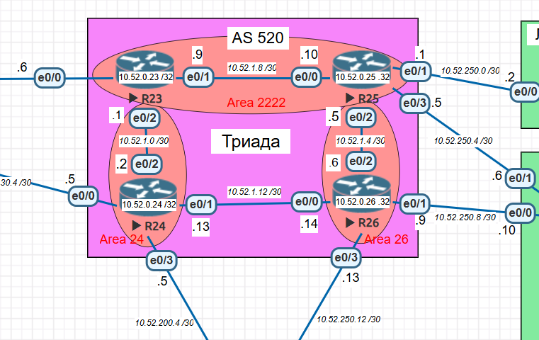

# IS-IS Настройка — Триада (AS 520)

## Задание:
1. Настроите IS-IS в ISP Триада.  
2. R23 и R25 находятся в зоне 2222.  
3. R24 находится в зоне 24.  
4. R26 находится в зоне 26.  

Настройка осуществляется одновременно для IPv4 и IPv6.  

## Адресация IPv4

Используем /30 для линков между маршрутизаторами.

| Линк      | Сеть            | Адреса                                         |
| --------- | --------------- | ---------------------------------------------- |
| R23 — R24 | 10.52.1.0/30    | R23 (0/2) 10.52.1.1, R24 (0/2) 10.52.1.2       |
| R23 — R25 | 10.52.1.8/30    | R23 (0/1) 10.52.1.9, R25 (0/0) 10.52.1.10      |
| R23 — R22 | 172.16.101.4/30 | R23 (0/0) 172.16.101.6, R22 (0/2) 172.16.101.5 |
| R24 — R21 | 172.16.30.4/30  | R24 (0/0) 172.16.30.5, R21 (0/2) 172.16.30.6   |
| R24 — R18 | 10.52.200.4/30  | R24 (0/3) 10.52.200.5, R18 (0/2) 10.52.200.6   |
| R25 — R27 | 10.52.250.0/30  | R25 (0/1) 10.52.250.1, R27 (0/0) 10.52.250.2   |
| R25 — R28 | 10.52.250.4/30  | R25 (0/3) 10.52.250.5, R28 (0/1) 10.52.250.6   |
| R26 — R25 | 10.52.1.4/30    | R26 (0/2) 10.52.1.6, R25 (0/2) 10.52.1.5       |
| R26 — R24 | 10.52.1.12/30   | R26 (0/0) 10.52.1.14, R24 (0/1) 10.52.1.13     |
| R26 — R28 | 10.52.250.8/30  | R26 (0/1) 10.52.250.9, R28 (0/0) 10.52.250.10  |
| R26 — R18 | 10.52.250.12/30 | R26 (0/3) 10.52.250.13, R18 (0/3) 10.52.250.14 |

Loopback'и:

| Router | Loopback       |
| ------ | -------------- |
| R23    | 10.23.23.23/32 |
| R24    | 10.24.24.24/32 |
| R25    | 10.25.25.25/32 |
| R26    | 10.26.26.26/32 |

<picture>
 
</picture>

## Настройка маршрутизаторов

#### R23

```
interface Loopback0
 ip address 10.23.23.23 255.255.255.255
 ipv6 address 2001:db8:23::23/128
 ip router isis TRIADA
 ipv6 router isis TRIADA
!
interface Ethernet0/0
 description R22
 ip address 172.16.101.6 255.255.255.252
 no shutdown
!
interface Ethernet0/1
 description R25
 ip address 10.52.1.9 255.255.255.252
 ipv6 address 2001:db8:52:2::1/64
 ip router isis TRIADA
 ipv6 router isis TRIADA
 isis network point-to-point
 no shutdown
!
interface Ethernet0/2
 description R24
 ip address 10.52.1.1 255.255.255.252
 ipv6 address 2001:db8:52:1::1/64
 ip router isis TRIADA
 ipv6 router isis TRIADA
 isis network point-to-point
 no shutdown
!
router isis TRIADA
 net 49.2222.0000.0000.0023.00
 is-type level-2-only
 metric-style wide
```

#### R24

```
interface Loopback0
 ip address 10.24.24.24 255.255.255.255
 ipv6 address 2001:db8:24::24/128
 ip router isis TRIADA
 ipv6 router isis TRIADA
!
interface Ethernet0/0
 description R21
 ip address 172.16.30.5 255.255.255.252
 no shutdown
!
interface Ethernet0/1
 description R26
 ip address 10.52.1.13 255.255.255.252
 ipv6 address 2001:db8:52:3::1/64
 ip router isis TRIADA
 ipv6 router isis TRIADA
 isis network point-to-point
 no shutdown
!
interface Ethernet0/2
 description R23
 ip address 10.52.1.2 255.255.255.252
 ipv6 address 2001:db8:52:1::2/64
 ip router isis TRIADA
 ipv6 router isis TRIADA
 isis network point-to-point
 no shutdown
!
interface Ethernet0/3
 description R18
 ip address 10.52.200.5 255.255.255.252
 no shutdown
!
router isis TRIADA
 net 49.0024.0000.0000.0024.00
 is-type level-2-only
 metric-style wide
```

#### R25

```
interface Loopback0
 ip address 10.25.25.25 255.255.255.255
 ipv6 address 2001:db8:25::25/128
 ip router isis TRIADA
 ipv6 router isis TRIADA
!
interface Ethernet0/0
 description R23
 ip address 10.52.1.10 255.255.255.252
 ipv6 address 2001:db8:52:2::2/64
 ip router isis TRIADA
 ipv6 router isis TRIADA
 isis network point-to-point
 no shutdown
!
interface Ethernet0/1
 description R27
 ip address 10.52.250.1 255.255.255.252
 no shutdown
!
interface Ethernet0/2
 description R26
 ip address 10.52.1.5 255.255.255.252
 ipv6 address 2001:db8:52:4::1/64
 ip router isis TRIADA
 ipv6 router isis TRIADA
 isis network point-to-point
 no shutdown
!
interface Ethernet0/3
 description R28
 ip address 10.52.250.5 255.255.255.252
 no shutdown
!
router isis TRIADA
 net 49.2222.0000.0000.0025.00
 is-type level-2-only
 metric-style wide
```

#### R26

```
interface Loopback0
 ip address 10.26.26.26 255.255.255.255
 ipv6 address 2001:db8:26::26/128
 ip router isis TRIADA
 ipv6 router isis TRIADA
!
interface Ethernet0/0
 description R24
 ip address 10.52.1.14 255.255.255.252
 ipv6 address 2001:db8:52:3::2/64
 ip router isis TRIADA
 ipv6 router isis TRIADA
 isis network point-to-point
 no shutdown
!
interface Ethernet0/1
 description R28
 ip address 10.52.250.9 255.255.255.252
 no shutdown
!
interface Ethernet0/2
 description R25
 ip address 10.52.1.6 255.255.255.252
 ipv6 address 2001:db8:52:4::2/64
 ip router isis TRIADA
 ipv6 router isis TRIADA
 isis network point-to-point
 no shutdown
!
interface Ethernet0/3
 description R18
 ip address 10.52.250.13 255.255.255.252
 no shutdown
!
router isis TRIADA
 net 49.0026.0000.0000.0026.00
 is-type level-2-only
 metric-style wide
```
